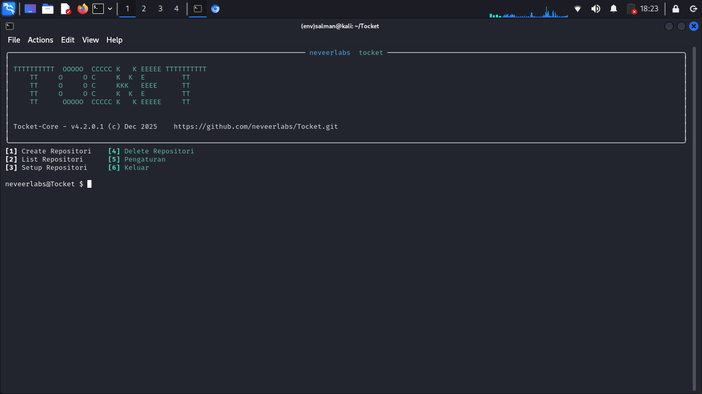
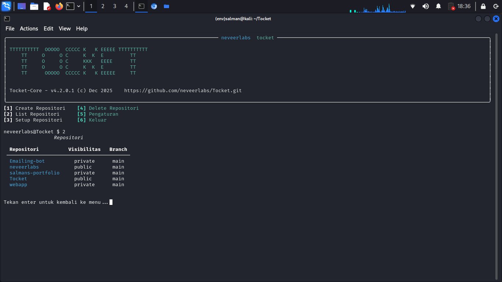
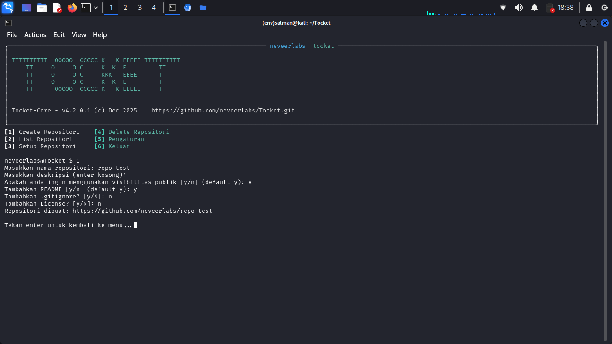
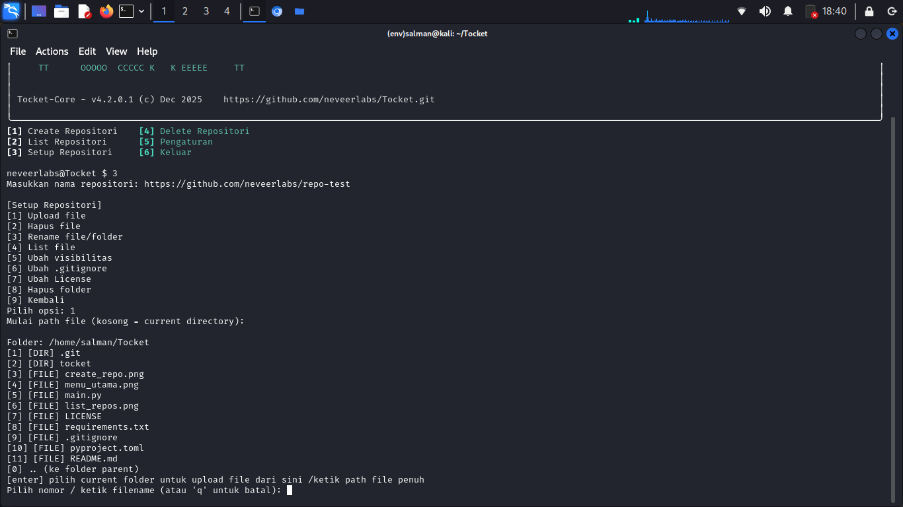
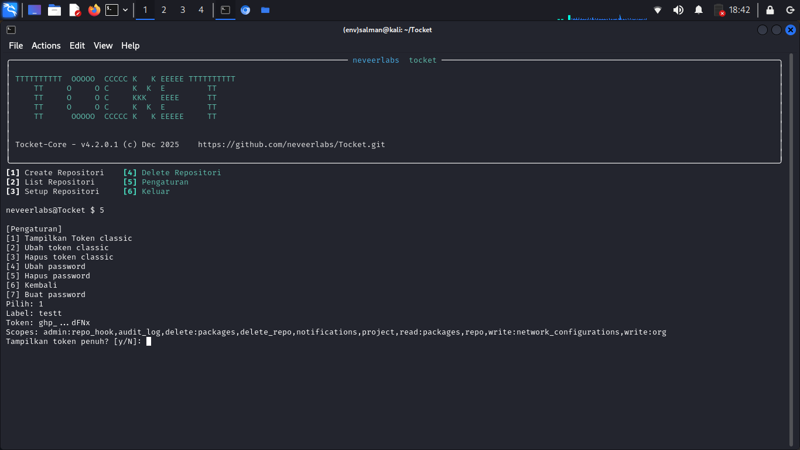
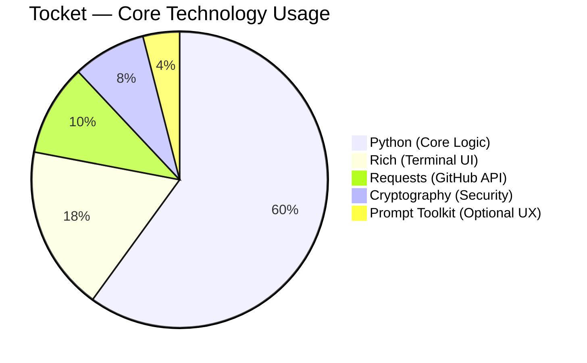

# Tocket

**Tocket** adalah *modern, secure, and opinionated CLI* untuk mengelola GitHub langsung dari terminal.
Dirancang buat developer yang hidupnya di terminal, males buka browser, tapi tetap peduli soal **security**, **speed**, dan **clean workflow**.

> Think of it as: *GitHub control panel, but terminal-native and actually usable.*

---

<p align="center">
  
</p>

<p align="center">
  
  
  
  
</p>

---

## Kenapa Tocket?

GitHub itu powerful, tapi UI web-nya tidak dibuat untuk workflow cepat.
Tocket lahir dari kebutuhan simpel:

* Kelola repo **tanpa keluar terminal**
* Token **gak disimpan polos**
* UI **gak norak**, tapi informatif
* Alur kerja **jelas dan bisa ditebak**

Tocket bukan sekadar wrapper API. Ini tool yang *punya pendapat* soal workflow GitHub di terminal.

---

## Fitur Utama

### Repository Management

* Create repository
* List repositories (user / org)
* Delete repository
* Change visibility (public ↔ private)

### File Operations (GitHub Contents API)

* Upload file (commit langsung)
* Delete file
* List repository tree
* Rename file / folder
* Recursive delete folder

### Security First

* GitHub token **dienkripsi AES‑GCM**
* Key diturunkan dari password lokal (PBKDF2‑HMAC‑SHA256)
* Tidak ada token plaintext di disk
* Tidak ada recovery password palsu (by design)

### UX & CLI Experience

* Terminal UI berbasis **Rich**
* Layout menu 2×3 yang konsisten
* Optional interactive file browser (`prompt_toolkit`)
* Keyboard-friendly, no mouse dependency

---

## Screenshots

### Main Menu


### List Repository



### Create Repository



### Upload File



### Token & Security Settings



---

## Requirements

* Python **3.13+** (recommended)
* Linux / Windows (Termux / Desktop) Terminal

Dependencies utama:

* `rich`
* `requests`
* `cryptography`
* `prompt_toolkit` (optional, UX enhancement)

---

## Installation (Development)

> **Penting:** Jalankan dari *project root*, bukan dari dalam folder `tocket/`.

```bash
python3 -m venv .venv
source .venv/bin/activate   # Linux / macOS
# .venv\Scripts\activate   # Windows PowerShell

pip install -r requirements.txt
python3 main.py
```

---

## Quick Start

Saat pertama kali dijalankan:

1. Password lokal **opsional**, tapi sangat disarankan
2. Masukkan GitHub classic token
3. Token divalidasi & dienkripsi otomatis

### Main Menu

```
[1] Create Repository
[2] List Repository
[3] Setup Repository
[4] Delete Repository
[5] Settings
[6] Exit
```

---

## Token & Password Model

* Token **tidak pernah** disimpan plaintext
* Password hanya dipakai untuk *key derivation*, bukan disimpan langsung
* Lupa password = token **tidak bisa dipulihkan**
* Reset berarti hapus token dari database

**Lokasi database:**

```
~/.tocket/tocket.db
```

> Jangan pernah commit file ini ke repo publik. Serius.

---

## Arsitektur Singkat

* CLI entrypoint → `main.py`
* GitHub API abstraction → `github_api.py`
* Security layer → AES‑GCM + PBKDF2
* Storage → SQLite lokal

Tocket sengaja **tidak bergantung** ke Git config atau credential helper.
Semua berdiri sendiri dan predictable.

---

## 🧩 Tech Stack Overview



## Batasan Teknis

* Upload file >100MB **tidak didukung** (limit GitHub API)
* Rename folder dilakukan via recreate + delete
* Permission bergantung pada scope token & role user

---

## Troubleshooting

### `No module named tocket.main`

Pastikan posisi direktori benar:

```bash
# BENAR
Tocket/
  ├─ tocket/
  └─ main.py
```

### Repository kosong

* Token invalid atau scope kurang (`repo`)

### Upload gagal

* Cek ukuran file
* Cek branch target
* Cek permission token

---

## Kontribusi

PR sangat diterima.

Workflow singkat:

1. Fork
2. Branch `feat/*` atau `fix/*`
3. Commit jelas
4. Pull Request ke `main`

> Jangan sertakan token, database, atau data sensitif.

---

## License

MIT License.
Gunakan, modifikasi, fork, dan kembangkan sesuka hati.

---

**Tocket** dibuat untuk developer yang mau kerja cepat, rapi, dan aman.
Kalau kamu suka terminal, kamu bakal betah di sini.
